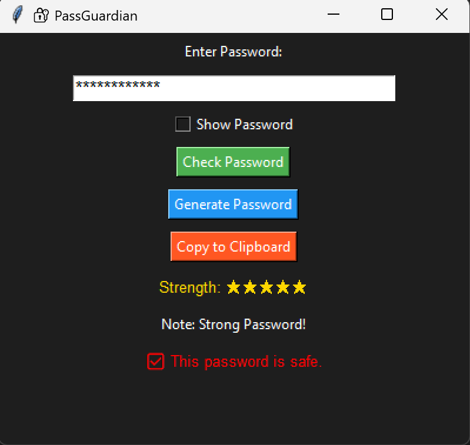

# 🔐 PassGuardian - Password Strength & Breach Checker



**PassGuardian** is a Python-based cybersecurity desktop application that helps users:
- ✅ Check password strength
- 🚨 Verify if a password has been involved in a data breach using the Have I Been Pwned API
- 🔐 Generate strong, secure passwords
- 👁️ Show/Hide password entries
- 📋 Copy passwords to clipboard

---

## 🧰 Tech Stack

- **Python 3.8+**
- **Tkinter** for GUI
- **HaveIBeenPwned API** (k-Anonymity model)
- **zxcvbn** for password strength analysis
- **pyperclip** for clipboard support

---

## 🎯 Features

| Feature                        | Description                                                                 |
|-------------------------------|-----------------------------------------------------------------------------|
| ✅ Password Strength Checker   | Uses zxcvbn to rate password from Weak to Strong                           |
| 🔐 Data Breach Checker        | Uses HaveIBeenPwned API (no full password is sent)                         |
| 🔁 Secure Password Generator  | Generates random strong passwords with letters, numbers & symbols          |
| 👁️ Show/Hide Password Toggle | Toggle password visibility using a checkbox                                |
| 📋 Copy to Clipboard          | Quickly copy generated/typed password to clipboard                         |
| 🌒 Dark-Themed UI             | Simple, clean, dark background GUI                                         |

---

## 📸 Screenshot

> 📌 Save this image as `screenshot.png` in the same folder.

You can take a screenshot of the running app using:
- Windows: `Win + Shift + S`
- Save it as `screenshot.png` in your project folder

---

## 🚀 How to Run

### 1. Clone the Repository

```bash
git clone https://github.com/your-username/passguardian.git
cd passguardian

